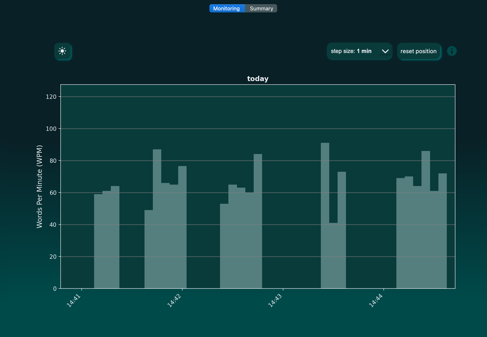
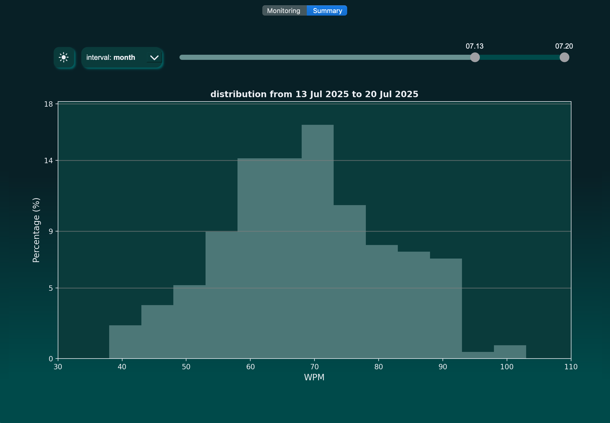
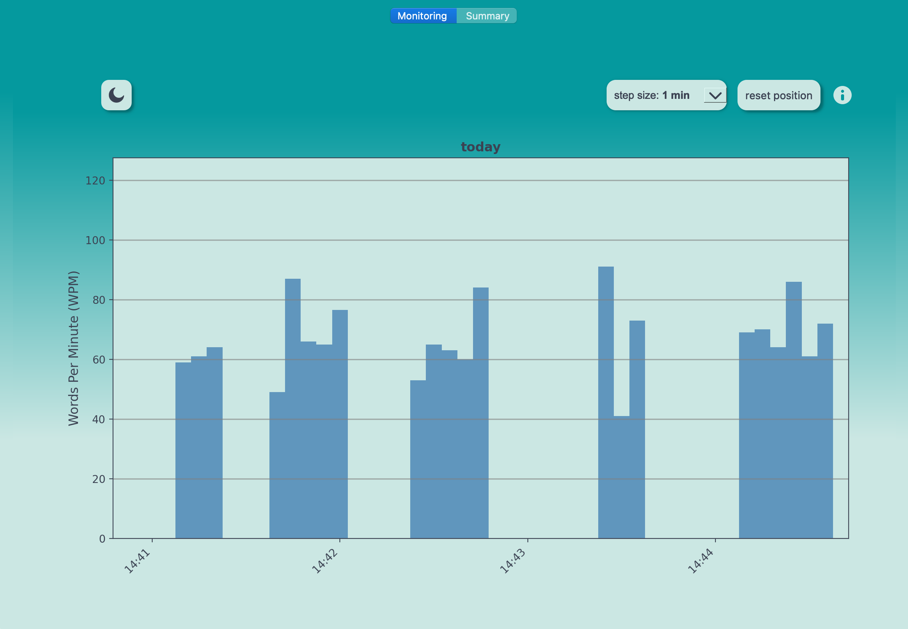
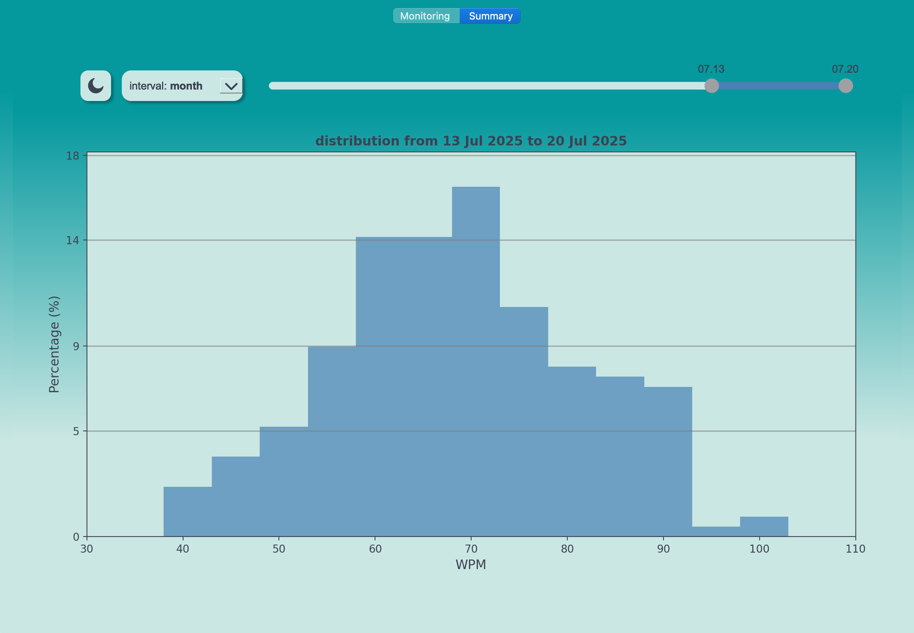

## TypeSpeedMonitor
To download and run the application, check out the latest release section.

### Screenshots

<div style="display: flex; justify-content: flex-start; gap: 20px;">

  <div style="text-align: center;">
    <p><strong>Monitoring</strong></p>
    
  </div>

  <div style="text-align: center;">
    <p><strong>Summary</strong></p>
    
  </div>

</div>

<br></br>

<div style="display: flex; justify-content: flex-start; gap: 20px;">

  <div style="text-align: center;">
    
  </div>

  <div style="text-align: center;">
    
  </div>

</div>

## Development

environment setup
```
conda install anaconda::pyqt 
conda install conda-forge::pynput
pip install appdirs
pip install matplotlib
conda install conda-forge::pyinstaller
```

create icon set
```
mkdir icon.iconset
sips -z 16 16     app_icon.png --out icon.iconset/icon_16x16.png
sips -z 32 32     app_icon.png --out icon.iconset/icon_16x16@2x.png
sips -z 32 32     app_icon.png --out icon.iconset/icon_32x32.png
sips -z 64 64     app_icon.png --out icon.iconset/icon_32x32@2x.png
sips -z 128 128   app_icon.png --out icon.iconset/icon_128x128.png
sips -z 256 256   app_icon.png --out icon.iconset/icon_128x128@2x.png
sips -z 256 256   app_icon.png --out icon.iconset/icon_256x256.png
sips -z 512 512   app_icon.png --out icon.iconset/icon_256x256@2x.png
sips -z 512 512   app_icon.png --out icon.iconset/icon_512x512.png
cp app_icon.png icon.iconset/icon_512x512@2x.png

iconutil -c icns icon.iconset
```

## Mac  
build executable
```
pyinstaller --onedir --windowed --noconfirm\
    --add-data "resources:resources" \
    --add-data "LICENSE:." \
    --icon=resources/icon.icns \
    --hidden-import PyQt6.QtCore \
    --hidden-import PyQt6.QtGui \
    --hidden-import PyQt6.QtWidgets \
    --hidden-import pynput \
    --hidden-import pynput.keyboard \
    --hidden-import pynput.mouse \
    --hidden-import matplotlib \
    --hidden-import matplotlib.backends.backend_qtagg \
    --hidden-import appdirs \
    --name "TypeSpeedMonitor" \
    main.py
```
build .dmg file
```
hdiutil create -volname "TypeSpeedMonitor" -srcfolder dist/TypeSpeedMonitor.app -ov -format UDZO TypeSpeedMonitor.dmg    
```

## Windows
build executable
```
pyinstaller --onedir --windowed --noconfirm`
    --add-data "resources;resources" `
    --add-data "LICENSE;." `
    --icon=resources\icon.icns `
    --hidden-import PyQt6.QtCore `
    --hidden-import PyQt6.QtGui `
    --hidden-import PyQt6.QtWidgets `
    --hidden-import pynput `
    --hidden-import pynput.keyboard `
    --hidden-import pynput.mouse `
    --hidden-import matplotlib `
    --hidden-import matplotlib.backends.backend_qtagg `
    --hidden-import appdirs `
    --name "TypeSpeedMonitor" `
    main.py
```
